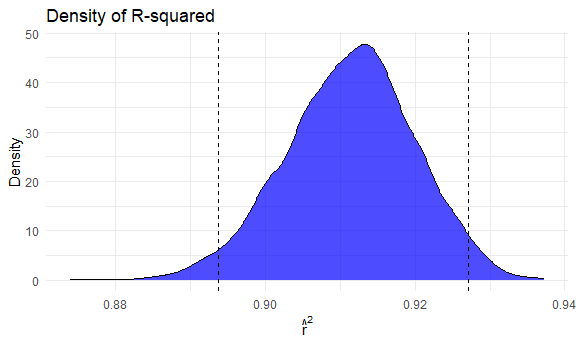
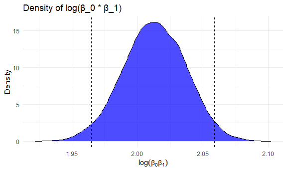
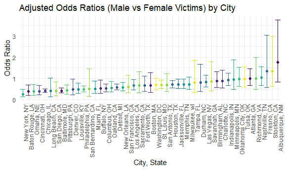

p8105_hw6_jw4690
================
Jingxi Wang
2024-11-30

## Problem 1

``` r
weather_df = 
  rnoaa::meteo_pull_monitors(
    c("USW00094728"),
    var = c("PRCP", "TMIN", "TMAX"), 
    date_min = "2017-01-01",
    date_max = "2017-12-31") %>%
  mutate(
    name = recode(id, USW00094728 = "CentralPark_NY"),
    tmin = tmin / 10,
    tmax = tmax / 10) %>%
  select(name, id, everything())
```

    ## using cached file: C:\Users\15280\AppData\Local/R/cache/R/rnoaa/noaa_ghcnd/USW00094728.dly

    ## date created (size, mb): 2024-09-26 10:19:57.621367 (8.668)

    ## file min/max dates: 1869-01-01 / 2024-09-30

``` r
# Create 5000 bootstrap samples

boot_samples <- weather_df %>%
  bootstrap(5000)

# Fit linear models to bootstrap samples

boot_results <- boot_samples %>%
  mutate(
    models = map(strap, ~ lm(tmax ~ tmin, data = .x)), 
    glance = map(models, broom::glance), 
    tidy = map(models, broom::tidy)
  )

# Extract R-squared values

r_squared_results <- boot_results %>%
  unnest(glance) %>%
  select(.id, r.squared)

# Extract log(beta_0 * beta_1)

log_beta_product <- boot_results %>%
  unnest(tidy) %>%
  filter(term %in% c("(Intercept)", "tmin")) %>%
  group_by(.id) %>%
  summarise(log_product = log(prod(estimate)))
```

``` r
# Confidence intervals for R-squared

conf_intervals_r2 <- r_squared_results %>%
  summarise(
    r_squared_lower = quantile(r.squared, 0.025),
    r_squared_upper = quantile(r.squared, 0.975)
  )

conf_intervals_r2
```

    ## # A tibble: 1 × 2
    ##   r_squared_lower r_squared_upper
    ##             <dbl>           <dbl>
    ## 1           0.894           0.927

``` r
# Confidence intervals for log(beta_0 * beta_1)

conf_intervals_log_product <- log_beta_product %>%
  summarise(
    log_product_lower = quantile(log_product, 0.025),
    log_product_upper = quantile(log_product, 0.975)
  )

conf_intervals_log_product
```

    ## # A tibble: 1 × 2
    ##   log_product_lower log_product_upper
    ##               <dbl>             <dbl>
    ## 1              1.96              2.06

``` r
# Plot distribution of R-squared

ggplot(r_squared_results, aes(x = r.squared)) +
  geom_density(fill = "blue", alpha = 0.7) +
  geom_vline(xintercept = conf_intervals_r2$r_squared_lower, linetype = "dashed") +
  geom_vline(xintercept = conf_intervals_r2$r_squared_upper, linetype = "dashed") +
  labs(
    title = "Density of R-squared",
    x = expression(hat(r)^2),
    y = "Density"
  )
```



The distribution of R-squared appears smooth and symmetric, resembling a
bell-shaped curve. The majority of the density is concentrated between
approximately 0.88 and 0.94. The dashed vertical lines represent the 95%
confidence interval, ranging from 0.894 to 0.927. This indicates that
the model consistently explains a large proportion of the variance in
tmax, with minimal variability in explanatory power. The density plot
confirms a lack of significant skewness, suggesting that the explanatory
power of tmin is generally stable across bootstrap samples.

``` r
# Plot distribution of log(beta_0 * beta_1)

ggplot(log_beta_product, aes(x = log_product)) +
  geom_density(fill = "blue", alpha = 0.7) +
  geom_vline(xintercept = conf_intervals_log_product$log_product_lower, linetype = "dashed") +
  geom_vline(xintercept = conf_intervals_log_product$log_product_upper, linetype = "dashed") +
  labs(
    title = "Density of log(β_0 * β_1)",
    x = expression(log(beta[0] * beta[1])),
    y = "Density"
  )
```



The density distribution is smooth, nearly symmetric, and centered
around 2.00, with the majority of the density concentrated between 1.95
and 2.10. The dashed vertical lines represent the 95% confidence
interval, spanning from 1.96 to 2.06. This narrow interval indicates
that the combined effect of β_0 and β_1 is highly consistent across
bootstrap samples. The absence of noticeable skewness or outliers
further suggests stability and reliability in this distribution.

The 95% confidence interval for R-squared is \[0.894, 0.927\]. This
indicates that the model explains approximately 89.4% to 92.7% of the
variance in tmax.

The 95% confidence interval for log(β_0 \* β_1) is \[1.96, 2.06\]. This
suggests that the combined influence of the intercept and slope is
consistent, with little variability, and its logarithmic value is
reliably within this range.

## Problem 2

``` r
homicide_data = read.csv("./data/homicide-data.csv", stringsAsFactors = FALSE)

# Create 'city_state' variable

homicide_data <- homicide_data %>%
  mutate(city_state = paste(city, state, sep = ", "))

# Filter the dataset

filtered_data = homicide_data %>%
  mutate(victim_age = as.numeric(victim_age),
         solved = ifelse(disposition == "Closed by arrest", 1, 0)) %>%
  filter(!(is.na(victim_age)),
         !(city_state %in% c("Dallas, TX", "Phoenix, AZ", "Kansas City, MO", "Tulsa, AL")),
         victim_race %in% c("White", "Black"))
```

``` r
# Subset data for Baltimore, MD

baltimore_data = filtered_data %>%
  filter(city_state == "Baltimore, MD")

# Fit logistic regression model

baltimore_model <- glm(solved ~ victim_age + victim_sex + victim_race,
                       data = baltimore_data, family = binomial)

# Summarize results with broom::tidy

baltimore_results <- broom::tidy(baltimore_model, conf.int = TRUE, exponentiate = TRUE) %>%
  filter(term == "victim_sexMale")

baltimore_results
```

    ## # A tibble: 1 × 7
    ##   term           estimate std.error statistic  p.value conf.low conf.high
    ##   <chr>             <dbl>     <dbl>     <dbl>    <dbl>    <dbl>     <dbl>
    ## 1 victim_sexMale    0.426     0.138     -6.18 6.26e-10    0.324     0.558

For Baltimore, MD, the odds ratio for “victim_sexMale” is 0.426. This
means that the odds of a homicide being solved for male victims are
approximately 57.4% lower than for female victims. Male victims’ cases
are significantly less likely to be solved compared to female victims.
The confidence interval for the odds ratio is (0.324, 0.558). Since the
entire interval is below 1, this difference is statistically significant
at the 5% level.

``` r
# Fit logistic regression and extract OR and CI

city_results <- filtered_data %>%
  group_by(city_state)%>%
  nest() %>%
  mutate(model = map(data, ~ glm(solved ~ victim_age + victim_sex + victim_race, 
               data = .x, family = binomial)),
    results = map(model, ~broom::tidy(.x, conf.int = TRUE, exponentiate = TRUE))) %>%
  unnest(results) %>%
  filter(term == "victim_sexMale") %>%
  select(city_state, estimate, conf.low, conf.high)

city_results
```

    ## # A tibble: 47 × 4
    ## # Groups:   city_state [47]
    ##    city_state      estimate conf.low conf.high
    ##    <chr>              <dbl>    <dbl>     <dbl>
    ##  1 Albuquerque, NM    1.77     0.825     3.76 
    ##  2 Atlanta, GA        1.00     0.680     1.46 
    ##  3 Baltimore, MD      0.426    0.324     0.558
    ##  4 Baton Rouge, LA    0.381    0.204     0.684
    ##  5 Birmingham, AL     0.870    0.571     1.31 
    ##  6 Boston, MA         0.674    0.353     1.28 
    ##  7 Buffalo, NY        0.521    0.288     0.936
    ##  8 Charlotte, NC      0.884    0.551     1.39 
    ##  9 Chicago, IL        0.410    0.336     0.501
    ## 10 Cincinnati, OH     0.400    0.231     0.667
    ## # ℹ 37 more rows

``` r
ggplot(city_results, aes(x = reorder(city_state, estimate), y = estimate, color = city_state)) +
  geom_point() +
  geom_errorbar(aes(ymin = conf.low, ymax = conf.high)) +
  labs(
    title = "Adjusted Odds Ratios (Male vs Female Victims) by City",
    x = "City, State",
    y = "Odds Ratio",
    color = "City"
  ) +
  theme_minimal() +
  theme(axis.text.x = element_text(angle = 90, hjust = 1), legend.position = "none")
```



Most cities have odds ratios below 1, indicating that homicides
involving male victims are generally less likely to be solved compared
to female victims. Some cities show ORs near or above 1 (e.g.,
Albuquerque, Stockton), indicating a more balanced or higher likelihood
of solving male victim cases. Wide confidence intervals in several
cities suggest limited data or variability, which reduces the
reliability of OR estimates in those areas.
