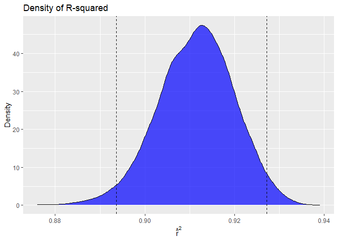

p8105_hw6_jw4690
================
Jingxi Wang
2024-11-30

# Problem 1

``` r
weather_df <- rnoaa::meteo_pull_monitors(
c("USW00094728"),
var = c("PRCP", "TMIN", "TMAX"),
date_min = "2017-01-01",
date_max = "2017-12-31"
) %>%
mutate(
name = recode(id, USW00094728 = "CentralPark_NY"),
tmin = tmin / 10,
tmax = tmax / 10
) %>%
select(name, id, everything())
```

    ## using cached file: C:\Users\15280\AppData\Local/R/cache/R/rnoaa/noaa_ghcnd/USW00094728.dly

    ## date created (size, mb): 2024-09-26 10:19:57.621367 (8.668)

    ## file min/max dates: 1869-01-01 / 2024-09-30

``` r
# Create 5000 bootstrap samples

boot_samples <- weather_df %>%
  bootstrap(5000)

# Fit linear models to bootstrap samples

boot_results <- boot_samples %>%
  mutate(
    models = map(strap, ~ lm(tmax ~ tmin, data = .x)), 
    glance = map(models, broom::glance), 
    tidy = map(models, broom::tidy)
  )

# Extract R-squared values

r_squared_results <- boot_results %>%
  unnest(glance) %>%
  select(.id, r.squared)

# Extract log(beta_0 * beta_1)

log_beta_product <- boot_results %>%
  unnest(tidy) %>%
  filter(term %in% c("(Intercept)", "tmin")) %>%
  group_by(.id) %>%
  summarise(log_product = log(prod(estimate)))
```

``` r
# Confidence intervals for R-squared

conf_intervals_r2 <- r_squared_results %>%
  summarise(
    r_squared_lower = quantile(r.squared, 0.025),
    r_squared_upper = quantile(r.squared, 0.975)
  )

conf_intervals_r2
```

    ## # A tibble: 1 × 2
    ##   r_squared_lower r_squared_upper
    ##             <dbl>           <dbl>
    ## 1           0.894           0.927

``` r
# Confidence intervals for log(beta_0 * beta_1)

conf_intervals_log_product <- log_beta_product %>%
  summarise(
    log_product_lower = quantile(log_product, 0.025),
    log_product_upper = quantile(log_product, 0.975)
  )

conf_intervals_log_product
```

    ## # A tibble: 1 × 2
    ##   log_product_lower log_product_upper
    ##               <dbl>             <dbl>
    ## 1              1.97              2.06

``` r
# Plot distribution of R-squared

ggplot(r_squared_results, aes(x = r.squared)) +
  geom_density(fill = "blue", alpha = 0.7) +
  geom_vline(xintercept = conf_intervals_r2$r_squared_lower, linetype = "dashed") +
  geom_vline(xintercept = conf_intervals_r2$r_squared_upper, linetype = "dashed") +
  labs(
    title = "Density of R-squared",
    x = expression(hat(r)^2),
    y = "Density"
  )
```

<!-- -->

The distribution of R-squared appears smooth and symmetric, resembling a
bell-shaped curve. The majority of the density is concentrated between
approximately 0.88 and 0.94. The dashed vertical lines represent the 95%
confidence interval, ranging from 0.894 to 0.927. This indicates that
the model consistently explains a large proportion of the variance in
tmax, with minimal variability in explanatory power. The density plot
confirms a lack of significant skewness, suggesting that the explanatory
power of tmin is generally stable across bootstrap samples.
